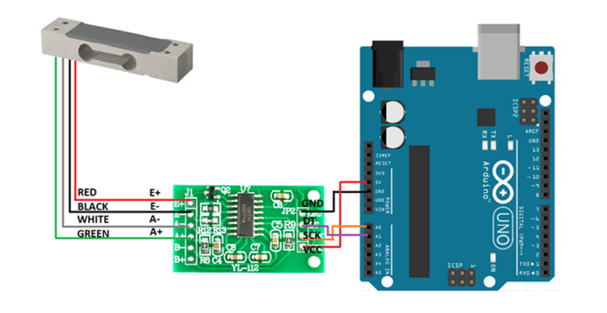
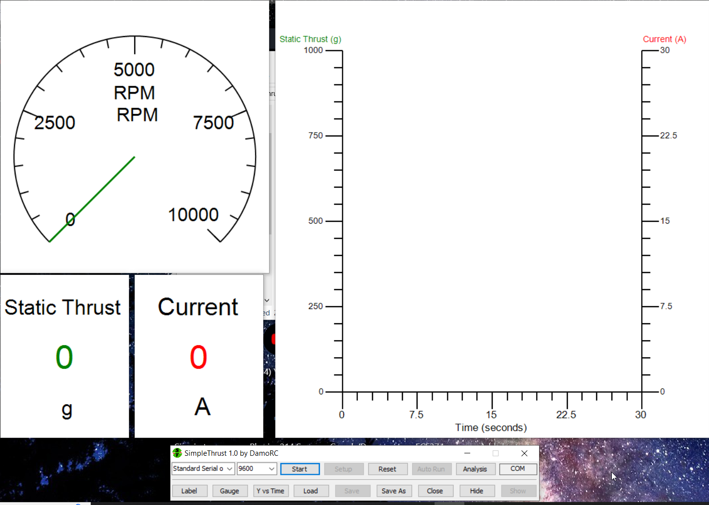
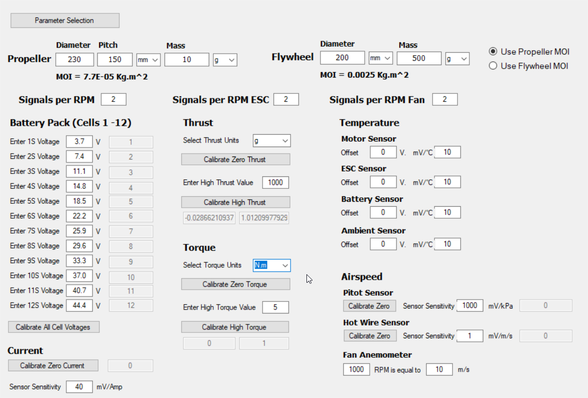

# SimpleThrust Sketch to Arduino Uno
This project aims to rewrite the SimpleThrust Arduino Mega sketch file to make it compatible with an Arduino Uno. It also fixes and combines this with an existing sketch used to produce a digital scale (force sensor) from a load cell and an LCD.

The SimpleThrust software itself, and relevant details about the serial output protocol can be found in the SimpleThrust documentation:

https://forum.flitetest.com/index.php?threads/simplethrust-open-source-software-for-your-thrust-stand-project.56111/

Only the force-sensing portion of the SimpleThrust serial output has been added to this sketch so far.


# Contents

 - [Setting up the Hardware](#setting-up-the-hardware)
 - [Uploading the Sketch](#uploading-the-sketch)
 - [Setting up SimpleThrust](#setting-up-simplethrust)
 - [Calibrating the Sensor](#calibrating-the-sensor-if-needed)
 - [Plotting and Recording Thrust with SimpleThrust](#plotting-and-recording-thrust-with-simplethrust)
 - [Using the SimpleThrust GUI (Optional)](#using-the-simplethrust-gui-optional)


# Setting up the Hardware

The Load Cell, the HX711 ADC chip, and the Arduino Uno can be connected as follows. If the HX711 chip is already connected to the Arduino, DO NOT CHANGE THAT CONNECTION.

The load cell - HX711 - Arduino connection (READ THE ABOVE PARAGRAPH FULLY):



The push buton connected to the Arduino's GPIO pins can be used to tare the scale when needed.

# Uploading the Sketch

The sketch should already be loaded onto the Arduino Uno in the digital scale. In case of any issues, the sketch file (.ino file) located in the SimpleThrust_Reduced_1.0 folder can be uploaded onto the Ardunio using the Arduino IDE application:

https://www.arduino.cc/en/software

# Setting up SimpleThrust

Once the SimpleThrust .zip file is downloaded and unzipped, the software can be run by running the executable (.exe) file. This should open the default configured GUI, looking like this:



Plug in the Arduino Uno via the included USB cable.

The key control panel for ST (SimpleThrust) is the small rectangular panel at the bottom of the screen.

In the first drop-down box, select the COM port to which the Arduino is connected.

Press the "Start" button. The software should begin to continuously graph the thrust read from the load cell.

# Calibrating the Sensor (If needed)

While the graph is running, the sensor can be calibrated by pressing the "Setup" button.

I have already calibrated the sensor to a reasonable degree of precision. These calibration settings can be copied over via the following values (Note the Thrust section):



If manual calibration is desired, follow this process:

1. Keep the load cell in its default state (without any thrust on it)
2. Press the "Calibrate Zero Thrust" button and wait for the calibration process to finish (this should take around 10 seconds)
3. Load the load cell with a constant known value of force, and enter that value in the "Enter High Thrust Value" parameter
4. Press the "Calibrate High Thrust" button, while the constant force is being applied to the Load Cell. Wait for the calibration to finish (this should take another 10 seconds)

# Plotting and Recording Thrust with SimpleThrust

At this point, the running graph should be working properly and precisely. In order to record runs of data, we must use the "Auto Run" feature, while the graph is running.

After pressing the AR (Auto Run) button, a text window should pop up, in order to enter the parameters for the AR.

The AR expects a list of comma-separated pairs of numbers. The first number indicates the point in time of that pair (in seconds), and the second number indicates the thrust value to be provided.

Since we are not using SimpleThrust's feature to automate thrust control, WE CAN LEAVE THE SECOND VALUE AS 0. We therefore also only need to provide two pairs of numbers.

Note that the first value is not a difference in time, and is rather a point in time.

As an example, we can set a two minute recording as follows:

```
0,0
120,0
```

i.e, the run begins at time = 0, and ends at time = 120 seconds.

Proceeding, the AR (Auto Run) will ask to save the AR file, which can be saved wherever desired.

When proceeding, the AR wil immediately start, and last for the duration specified.

After the AR is complete, we can press the "Analysis" button to open a result analysis window.
Within this window, press "Add file" and select the saved Auto Run file.

The usage of the Analysis window is fairly straightforward, and will not be covered in detail here. Once again, the SimpleThrust documentation can be referred to for further details.

When using the Analysis window, you can click on a point in the graph in order to obtain a trace at that point.

# Using the SimpleThrust GUI (Optional)

The bottom row on the SimpleThrust control panel relates to GUI elements.

Some key ways to control the GUI are:

- Double clicking a GUI element to delete it
- Right clicking a GUI element to change it's source of reading

GUI configs can be saved from the control panel.